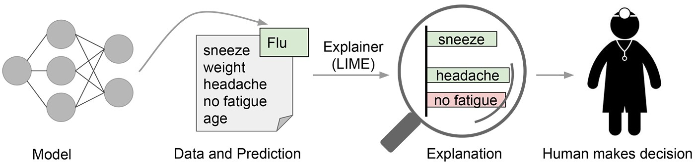
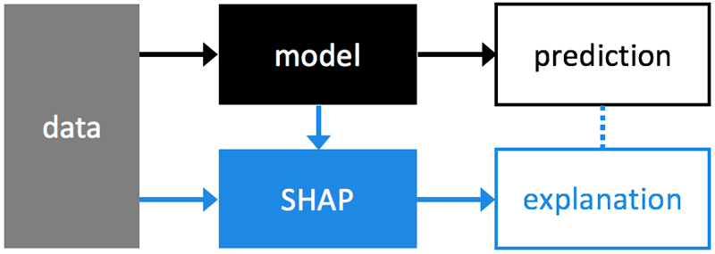

# Model Interpretability

- We have often found that Machine Learning (ML) algorithms capable of capturing structural non-linearities in training data - models that are sometimes referred to as "black box" (e.g. Random Forests, Deep Neural Networks, etc.) - perform far better at prediction than their linear counterparts (e.g. Generalized Linear Models).

- They are, however, much harder to interpret - in fact, quite often it is not possible to gain any insight into why a particular prediction has been produced, when given an instance of input data (i.e. the model features).

- Consequently, it has not been possible to use "black box" ML algorithms in situations where clients have sought cause-and-effect explanations for model predictions, with end-results being that sub-optimal predictive models have been used in their place, as their explanatory power has been more valuable, in relative terms.

- The problem with model explainability is that it's very hard to define a model's decision boundary in human understandable manner.

- In this project, I'm using LIME and SHAP to interpret RandomForest models for both classification and regression problems.

 

## LIME

- LIME is a python library which tries to solve for model interpretability by producing locally faithful explanations.

  

 

### Model Interpretability using LIME

- LIME stands for Local Interpretable Model-Agnostic Explanations is a technique to explain the predictions of any machine learning classifier, and evaluate its usefulness in various tasks related to trust.

 

## SHAP

- SHAP (SHapley Additive exPlanations) is a unified approach to explain the output of any machine learning model.

  

 

### Model Interpretability using SHAP

- SHAP connects game theory with local explanations, uniting several previous methods and representing the only possible consistent and locally accurate additive feature attribution method based on expectations.

 

## Folder Hierarchy

- [data](https://github.com/marwahsparsh24/model-interpretability-for-machine-learning-models/tree/master/data) folder contains the dataset used in the classification and regression models.

  - [Boston.csv](https://github.com/marwahsparsh24/model-interpretability-for-machine-learning-models/blob/master/data/Boston.csv) is used for regression models. This dataset was taken from UCI Machine Learning Repository from this [link](https://archive.ics.uci.edu/ml/datasets/Housing).
  
  - [mushrooms.csv](https://github.com/marwahsparsh24/model-interpretability-for-machine-learning-models/blob/master/data/mushrooms.csv) is used for classification models. This dataset was taken from UCI Machine Learning Repository from this [link](https://archive.ics.uci.edu/ml/datasets/Mushroom).
  
  
- [lime](https://github.com/marwahsparsh24/model-interpretability-for-machine-learning-models/tree/master/lime)

  - [classification](https://github.com/marwahsparsh24/model-interpretability-for-machine-learning-models/tree/master/lime/classification): This folder contains the notebook with classification dataset.
  
  - [regression](https://github.com/marwahsparsh24/model-interpretability-for-machine-learning-models/tree/master/lime/regression): This folder contains the notebook with regression dataset.

- [shap](https://github.com/marwahsparsh24/model-interpretability-for-machine-learning-models/tree/master/shap)

  - [classification](https://github.com/marwahsparsh24/model-interpretability-for-machine-learning-models/tree/master/shap/classification): This folder contains the notebook with classification dataset.
  
  - [regression](https://github.com/marwahsparsh24/model-interpretability-for-machine-learning-models/tree/master/shap/regression): This folder contains the notebook with regression dataset.
  
  
 
 - If the notebooks don't render in github, open them using [nbviewer](https://nbviewer.jupyter.org/).
 
   - Open the notebook in github.
   
   - Copy the page URL.
   
   - Paste the URL in [nbviewer](https://nbviewer.jupyter.org/).
   
   - Click on Go. Notebook will open in [nbviewer](https://nbviewer.jupyter.org/).

 

## Maintainer

This project is maintained by Sparsh Marwah, a Data Scientist with over 3 years of professional experience in Python, SQL, and Machine Learning.

- Email: marwahsparsh24@gmail.com
- GitHub: https://github.com/marwahsparsh24
- LinkedIn: https://www.linkedin.com/in/sparsh-marwah/